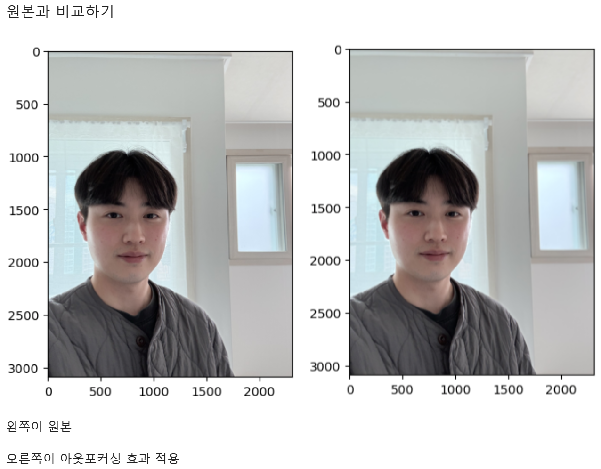
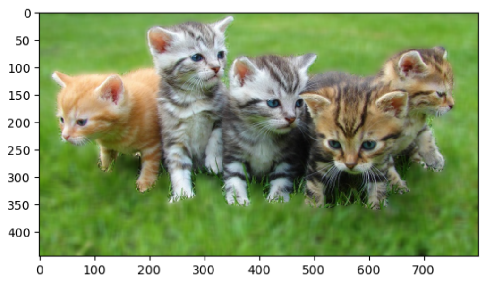
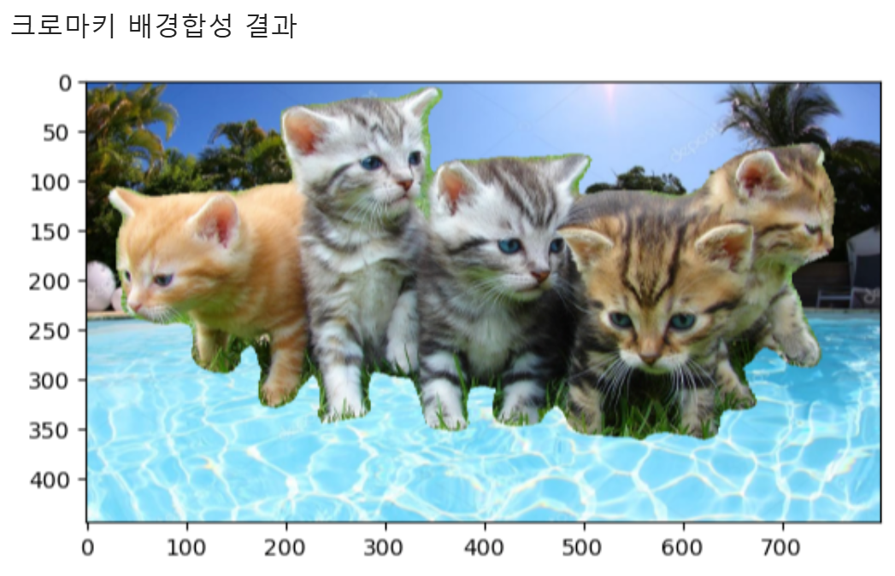
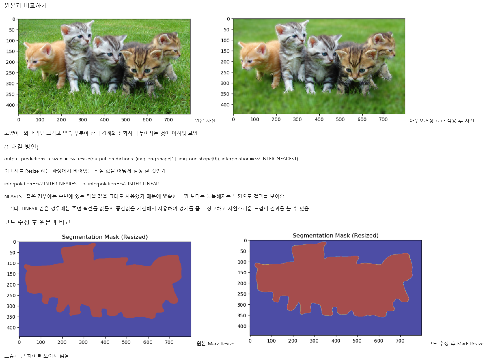
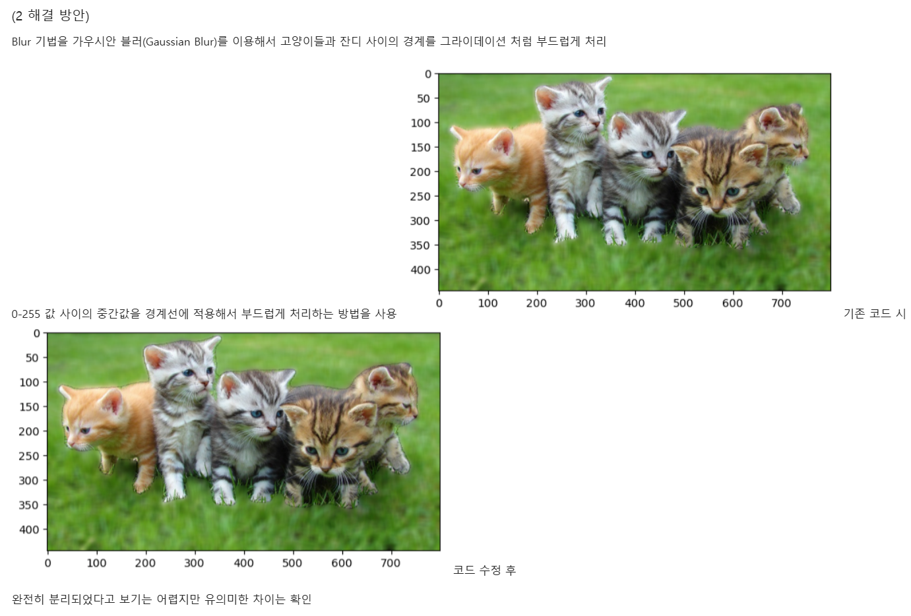

# AIFFEL Campus Online Code Peer Review Templete
- 코더 : 김도현
- 리뷰어 : 정민규


# PRT(Peer Review Template)
- [x]  **1. 주어진 문제를 해결하는 완성된 코드가 제출되었나요?**
    - 문제에서 요구하는 최종 결과물이 첨부되었는지 확인
        - 중요! 해당 조건을 만족하는 부분을 캡쳐해 근거로 첨부
    
- [ ]  **2. 전체 코드에서 가장 핵심적이거나 가장 복잡하고 이해하기 어려운 부분에 작성된 
주석 또는 doc string을 보고 해당 코드가 잘 이해되었나요?**
    - 해당 코드 블럭을 왜 핵심적이라고 생각하는지 확인
    - 해당 코드 블럭에 doc string/annotation이 달려 있는지 확인
    - 해당 코드의 기능, 존재 이유, 작동 원리 등을 기술했는지 확인
    - 주석을 보고 코드 이해가 잘 되었는지 확인
        - 중요! 잘 작성되었다고 생각되는 부분을 캡쳐해 근거로 첨부
        - 
        - 
        -  
        
- [x]  **3. 에러가 난 부분을 디버깅하여 문제를 해결한 기록을 남겼거나
새로운 시도 또는 추가 실험을 수행해봤나요?**
    - 문제 원인 및 해결 과정을 잘 기록하였는지 확인
    - 프로젝트 평가 기준에 더해 추가적으로 수행한 나만의 시도, 
    실험이 기록되어 있는지 확인
        - 중요! 잘 작성되었다고 생각되는 부분을 캡쳐해 근거로 첨부
        - 
        - 
        
- [ ]  **4. 회고를 잘 작성했나요?**
    - 주어진 문제를 해결하는 완성된 코드 내지 프로젝트 결과물에 대해
    배운점과 아쉬운점, 느낀점 등이 기록되어 있는지 확인
    - 전체 코드 실행 플로우를 그래프로 그려서 이해를 돕고 있는지 확인
        - 중요! 잘 작성되었다고 생각되는 부분을 캡쳐해 근거로 첨부
        
- [ ]  **5. 코드가 간결하고 효율적인가요?**
    - 파이썬 스타일 가이드 (PEP8) 를 준수하였는지 확인
    - 코드 중복을 최소화하고 범용적으로 사용할 수 있도록 함수화/모듈화했는지 확인
        - 중요! 잘 작성되었다고 생각되는 부분을 캡쳐해 근거로 첨부


# 회고(참고 링크 및 코드 개선)
```
# 퀘스트에서 요구하는 결과를 모두 잘 제시하였습니다.
# 개선점: 
1. 인물 사진에서 배경에 블러 효과가 약하게 들어갔다고 하셔서, 
img_orig_blur = cv2.blur(img_orig, (13, 13)) -> img_orig_blur = cv2.blur(img_orig, (100, 100))처럼 blur 효과를 키우는 방법을 제안드렸다.
2. 동물 사진에서 엣지 부분이 잘 포착되지 않는 문제의 해결책으로 cv2로 resize 할 때 보간 방법을 다르게 적용했지만 별로 효과가 없다고 하셔서,
"모델이 segmentation -> cv2로 resize해서 시각화" 과정을 거치는 만큼, 
모델이 segmentation할 때 이미 edge를 잘 포착하지 못한 상태니까 시각화할 때 보정을 다르게 해도 효과가 미미했던 것 같다고 피드백을 드렸다.
```
